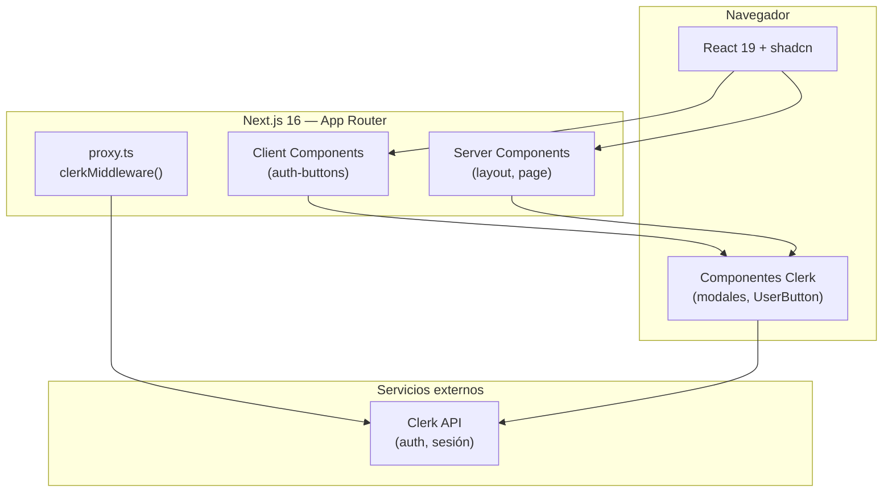
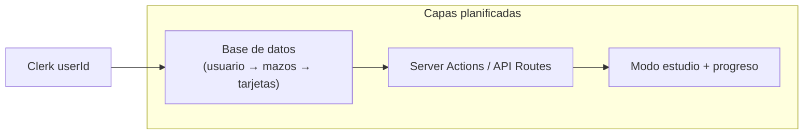

# Arquitectura — Flashy Cardy Course

Documentación viva del proyecto. Objetivo: que alguien ajeno al repositorio entienda **qué es la app**, **cómo está montada** y **cómo reproducir el entorno** sin depender del historial del chat.

> **Última revisión:** 2026-05-19 · **Estado:** fundación (landing + autenticación). Capas de datos y mazos de flashcards aún no implementadas.

---

## 1. Visión del producto

**Flashy Cardy Course** es una aplicación web para aprender con **flashcards**: crear mazos, estudiar y seguir el progreso. Hoy el código cubre:

| Capa | Estado |
|------|--------|
| Landing pública (`/`) | Implementada |
| Autenticación (registro / inicio de sesión) | Implementada (Clerk) |
| Mazos, tarjetas, estudio, progreso | **Pendiente** |

La arquitectura actual prioriza una base sólida: **Next.js App Router**, **UI con shadcn**, **auth gestionada** y convenciones claras para crecer sin reescribir.

---

## 2. Stack tecnológico

| Tecnología | Versión (aprox.) | Rol |
|------------|------------------|-----|
| [Next.js](https://nextjs.org) | 16.x | Framework full-stack, App Router, SSR/RSC |
| [React](https://react.dev) | 19.x | UI |
| [TypeScript](https://www.typescriptlang.org) | 5.x | Tipado estático |
| [Tailwind CSS](https://tailwindcss.com) | 4.x | Estilos utility-first (`@import "tailwindcss"`) |
| [shadcn/ui](https://ui.shadcn.com) | 4.x (estilo **base-nova**) | Componentes accesibles sobre primitivos |
| [@base-ui/react](https://base-ui.com) | 1.x | Primitivos headless (p. ej. `Button`) |
| [Clerk](https://clerk.com) | 7.x | Autenticación y sesión de usuario |
| [Lucide](https://lucide.dev) | — | Iconos (vía shadcn) |

**Runtime de proxy (Next 16):** el archivo `proxy.ts` sustituye al antiguo `middleware.ts`. Ejecuta en **Node.js**, no en Edge. Ver [guía Next.js 16 — middleware → proxy](https://nextjs.org/docs/app/building-your-application/routing/middleware#proxy).

**Nota para agentes y contribuidores:** este proyecto usa APIs de Next.js 16 que pueden diferir de versiones anteriores. Consultar `node_modules/next/dist/docs/` antes de asumir patrones de Next 14/15.

---

## 3. Estructura del repositorio

```
flashycardycourse/
├── app/                    # App Router (rutas, layouts, estilos globales)
│   ├── layout.tsx          # Layout raíz: fuentes, Clerk, cabecera
│   ├── page.tsx            # Página de inicio (/)
│   └── globals.css         # Tokens de diseño, tema oscuro, Tailwind + shadcn
├── components/
│   ├── ui/                 # Componentes shadcn (p. ej. button.tsx)
│   └── auth-buttons.tsx    # Botones Sign In / Sign Up (cliente)
├── lib/
│   └── utils.ts            # Utilidad `cn()` para clases CSS
├── docs/
│   └── ARCHITECTURE.md     # Este documento
├── proxy.ts                # Proxy de red (auth Clerk en cada request)
├── components.json         # Configuración shadcn CLI
├── next.config.ts
├── postcss.config.mjs
├── tsconfig.json           # Alias `@/*` → raíz del proyecto
├── package.json
└── .cursor/rules/          # Reglas para el IDE (p. ej. obligar shadcn)
```

### Alias de importación

En `tsconfig.json`, `@/*` apunta a la raíz del proyecto:

```ts
import { Button } from "@/components/ui/button";
import { cn } from "@/lib/utils";
```

`components.json` define los mismos alias para la CLI de shadcn (`@/components`, `@/lib`, `@/hooks`, etc.).

---

## 4. Diagrama de capas (estado actual)



**Flujo de una petición:**

1. El navegador solicita una ruta (p. ej. `/`).
2. `proxy.ts` ejecuta `clerkMiddleware()` y adjunta contexto de sesión Clerk cuando aplica.
3. Next renderiza el árbol RSC: `app/layout.tsx` envuelve la app en `ClerkProvider` y pinta la cabecera.
4. `app/page.tsx` renderiza el contenido de la landing (Server Component, sin `"use client"`).
5. Los botones de auth son Client Components que abren modales de Clerk.

---

## 5. Enrutado y páginas

| Ruta | Archivo | Tipo | Descripción |
|------|---------|------|-------------|
| `/` | `app/page.tsx` | Server Component | Landing: bienvenida y CTA para autenticarse |

No hay rutas API (`app/api/`) ni rutas dinámicas todavía. Cuando existan mazos o estudio, se recomienda:

- Rutas bajo `app/(dashboard)/...` o `app/decks/[id]/...`
- Server Actions o Route Handlers para mutaciones
- Protección con `auth()` de Clerk en servidor

---

## 6. Autenticación (Clerk)

### Responsabilidades

| Pieza | Ubicación | Función |
|-------|-----------|---------|
| Middleware de sesión | `proxy.ts` | Intercepta requests; integra Clerk en el pipeline de Next |
| Proveedor de contexto | `app/layout.tsx` → `ClerkProvider` | Tema oscuro Clerk (`@clerk/ui/themes`) |
| UI condicional | `Show` + `UserButton` / `AuthButtons` | Cabecera según `signed-in` / `signed-out` |
| Botones modales | `components/auth-buttons.tsx` | `SignInButton` / `SignUpButton` con `mode="modal"` |

### Patrón Server vs Client

- **Server:** `layout.tsx` usa `ClerkProvider`, `Show`, `UserButton` sin `"use client"` donde Clerk lo permite en tu versión.
- **Client:** `auth-buttons.tsx` declara `"use client"` porque envuelve botones shadcn dentro de los triggers de Clerk.

### Proteger rutas futuras

Ejemplo orientativo (no implementado aún):

```ts
// app/dashboard/page.tsx
import { auth } from "@clerk/nextjs/server";
import { redirect } from "next/navigation";

export default async function DashboardPage() {
  const { userId } = await auth();
  if (!userId) redirect("/");
  // ...
}
```

También se puede restringir en `proxy.ts` con `createRouteMatcher` de Clerk.

---

## 7. Interfaz de usuario y diseño

### shadcn/ui

- Configuración: `components.json` — estilo **base-nova**, `cssVariables: true`, iconos **lucide**.
- Componentes instalados: `components/ui/button.tsx` (más se añaden con la CLI).
- **Regla del proyecto:** no introducir otras librerías de componentes (MUI, Chakra, etc.). Ver `.cursor/rules/shadcn-ui.mdc`.

Añadir un componente:

```bash
npx shadcn@latest add card
```

### Tema y tipografía

- **Modo oscuro fijo:** `<html className="dark ...">` en `layout.tsx`.
- **Fuente:** Poppins vía `next/font/google`, variable CSS `--font-poppins`.
- **Tokens:** `app/globals.css` define variables OKLCH (`--background`, `--card`, `--primary`, etc.) y las expone a Tailwind con `@theme inline`.
- **Colores de marca en landing:** acentos puntuales (`text-blue-500`, `bg-[#0f172a]`) además de tokens semánticos (`bg-card`).

### Utilidad `cn()`

`lib/utils.ts` combina `clsx` + `tailwind-merge` para fusionar clases sin conflictos. Usar en todos los componentes con variantes.

---

## 8. Proxy (`proxy.ts`)

Equivalente al middleware de Next.js anteriores, renombrado en v16:

```ts
import { clerkMiddleware } from "@clerk/nextjs/server";

export default clerkMiddleware();

export const config = {
  matcher: [
    "/((?!_next|[^?]*\\.(?:html?|css|js(?!on)|jpe?g|webp|png|gif|svg|ttf|woff2?|ico|csv|docx?|xlsx?|zip|webmanifest)).*)",
    "/(api|trpc)(.*)",
  ],
};
```

El `matcher` excluye estáticos de `_next` y archivos con extensión, y aplica a rutas `api` futuras.

---

## 9. Variables de entorno

Los secretos **no** se commitean (`.gitignore` ignora `.env*`).

Crear `.env.local` en la raíz (plantilla en `.env.example`):

| Variable | Obligatoria | Descripción |
|----------|-------------|-------------|
| `NEXT_PUBLIC_CLERK_PUBLISHABLE_KEY` | Sí | Clave pública de la aplicación Clerk |
| `CLERK_SECRET_KEY` | Sí | Clave secreta (solo servidor) |

Opcionales habituales de Clerk (URLs de redirección, webhooks, etc.) se documentarán cuando se configuren flujos adicionales.

### Obtener las claves

1. Crear aplicación en [Clerk Dashboard](https://dashboard.clerk.com).
2. Copiar **Publishable key** y **Secret key** al `.env.local`.
3. En desarrollo, Clerk suele aceptar `http://localhost:3000` como origen.

---

## 10. Cómo replicar el proyecto desde cero

### Requisitos

- Node.js 20+ (recomendado LTS)
- npm (o pnpm/yarn/bun)

### Pasos

```bash
# 1. Clonar e instalar dependencias
git clone <url-del-repo>
cd flashycardycourse
npm install

# 2. Configurar entorno
cp .env.example .env.local
# Editar .env.local con las claves de Clerk

# 3. Arrancar en desarrollo
npm run dev
```

Abrir [http://localhost:3000](http://localhost:3000). La cabecera muestra **Sign In** / **Sign Up**; tras autenticarse, **UserButton**.

### Scripts npm

| Script | Uso |
|--------|-----|
| `npm run dev` | Servidor de desarrollo (Turbopack) |
| `npm run build` | Build de producción |
| `npm run start` | Servir build |
| `npm run lint` | ESLint (config Next core-web-vitals + TypeScript) |

### Despliegue

Despliegue típico en [Vercel](https://vercel.com): definir las mismas variables de entorno de Clerk en el panel del proyecto. El build usa `next build` sin configuración extra en `next.config.ts` por ahora.

---

## 11. Convenciones de desarrollo

| Tema | Convención |
|------|------------|
| UI | shadcn desde `@/components/ui/*`; instalar antes de reinventar |
| Estilos | Tailwind + tokens en `globals.css`; `cn()` para clases compuestas |
| Componentes cliente | Solo `"use client"` cuando haya estado, efectos o APIs del navegador |
| Auth | Clerk; no implementar auth casera |
| Imports | Alias `@/` |
| Commits de secretos | Nunca `.env*` ni `/.clerk/` |

### Herramientas del IDE

- `AGENTS.md` / `CLAUDE.md`: recordatorio de leer docs de Next 16 en `node_modules/next/dist/docs/`.
- `.cursor/rules/shadcn-ui.mdc`: política de componentes UI.

---

## 12. Evolución prevista (no implementada)

Esta sección describe la **dirección** acordada con el producto; actualizar al implementar cada pieza.



| Capa | Decisión pendiente | Notas |
|------|-------------------|--------|
| Persistencia | Por definir (p. ej. Drizzle + Postgres, Prisma, etc.) | Asociar datos al `userId` de Clerk |
| Modelo de dominio | `Deck`, `Card`, `StudySession`, … | CRUD por usuario autenticado |
| Rutas protegidas | Dashboard, editor de mazo, sesión de estudio | `auth()` + layouts anidados |
| API | Server Actions preferidas para mutaciones simples | Route Handlers si hace falta REST/webhooks |

Al añadir cada capa, documentar aquí: esquema de datos, diagrama de flujo y rutas nuevas.

---

## 13. Mantenimiento de este documento

Actualizar **ARCHITECTURE.md** cuando ocurra cualquiera de:

- Nueva dependencia o servicio externo
- Nueva ruta, layout o convención de carpetas
- Cambio en auth, proxy o variables de entorno
- Primera versión de base de datos o modelo de dominio
- Cambio relevante de UI (sistema de diseño, tema claro/oscuro, etc.)

Incluir fecha en la cabecera y una línea en el changelog inferior.

### Changelog

| Fecha | Cambio |
|-------|--------|
| 2026-05-19 | Documento inicial: stack, estructura, auth Clerk, UI shadcn, proxy Next 16, guía de réplica |
